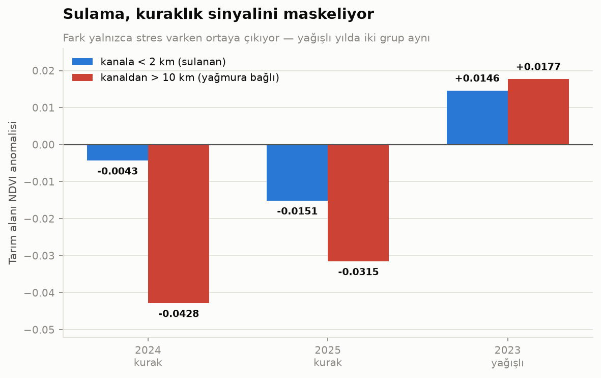
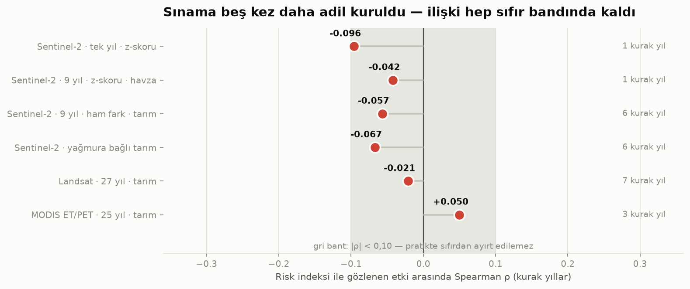

# AHP Tabanlı Tarımsal Kuraklık Risk Haritalama — Gediz Havzası

[](https://github.com/dogadurak/AHPDr/actions/workflows/test.yml)
[](https://github.com/dogadurak/AHPDr/actions/workflows/deploy-web.yml)
[](LICENSE)
[](https://www.python.org/)

Çok Kriterli Karar Verme (AHP) ile üretilen 5 sınıflı tarımsal kuraklık risk
haritası, duyarlılık analizi ve NDVI zaman serisi görselleştirmesi.

**Kapsam:** 18 analiz adımı · ~11.000 satır Python · 296 test · iki CI iş akışı
/ üç iş (birim testleri · veri sağlayıcı sözleşmesi · Pages dağıtımı) · anahtar
gerektirmeyen açık veri · iki arayüz, tek veri dosyası.

> **In brief (EN).** A nine-criterion AHP drought-risk map for the Gediz basin
> (Türkiye) at 30 m, built entirely from key-free open data, then tested against
> independent satellite observations across 1985–2025. The map passes every
> internal-consistency check (CR = 0.0093, 100% k-means agreement, ±10% weight
> sensitivity ≥ 92.4%) — and **fails** to predict where vegetation actually
> suffers during real droughts (Spearman ρ = −0.021 over seven drought years).
> The negative result is reported rather than hidden, together with the two
> independent impact measures and the rejected explanatory hypothesis that
> rule out the easy excuses. Full write-up below (Turkish).

**Pilot bölge:** Gediz Havzası, Manisa — Salihli / Alaşehir / Sarıgöl hattı
(Demirköprü Barajı membaı dahil), 27.6°E–28.6°E, 38.2°N–38.7°N → **4.974 km²**,
30 m çözünürlükte 5,53 milyon hücre.  
**Referans dönemi:** 2017–2025 (9 yıl) · **İklim serisi:** 1958–2025 (68 yıl)


> **🌐 Etkileşimli vitrin:** <https://dogadurak.github.io/AHPDr/> — harita,
> AHP ağırlıkları, sulama etkisi ve doğrulamanın olumsuz sonucu.
> *(GitHub Pages'i Settings → Pages → Source: GitHub Actions ile bir kez açmak
> gerekiyor.)*
>
> **📊 Statik görsel özet:** bütün bulgular tek sayfada —
> [claude.ai/code/artifact/169dfe78-f7a6-400b-bc4d-b4101939202a](https://claude.ai/code/artifact/169dfe78-f7a6-400b-bc4d-b4101939202a)
> (şablon: [`docs/ozet_sablon.html`](docs/ozet_sablon.html), grafikler:
> [`src/visualize_summary.py`](src/visualize_summary.py))

---

## Ölçümler — bir bakışta

Harita, iç tutarlılık sınamalarının **hepsini** geçiyor. Gözlenen kuraklık
etkisini öngörme sınamasını **geçemiyor**. İkisi de aşağıda; ikincisi bu
projenin asıl bulgusu ve gizlenmedi.

| Sınama | Ne ölçüyor | Ölçüm | Hüküm |
|---|---|---:|---|
| Tutarlılık oranı (CR) | 9×9 ikili karşılaştırma matrisi kendi içinde tutarlı mı | 0,0093 (eşik 0,10) | geçti |
| k-means uyumu | bağımsız bir sınıflandırma aynı sınırları buluyor mu | %99,7 | geçti |
| Ağırlık duyarlılığı | her ağırlık ±%10 oynatılınca sınıflar korunuyor mu | en kötü %93,1 piksel aynı sınıfta | geçti |
| Senaryo dayanıklılığı | eğimin tartışmalı risk yönü sonucu altüst ediyor mu | %79,4 aynı sınıf · %100'ü ≤ 1 sınıf | geçti |
| ET/PET sıralaması | bağımsız MODIS ürünü risk sırasını doğruluyor mu | ρ = −0,283, monoton | geçti |
| **Gerçek kuraklıklarda mekânsal sıralama** | Landsat 5 ile 27 yıl, 7 gerçek kurak yıl (1985–2011) | **ρ = −0,023** | **desteklenmedi** |
| İkinci bağımsız etki ölçüsü | aynı sınama ET/PET anomalisiyle tekrarlandı | ρ = +0,045 | **desteklenmedi** |
| "Düşük değişkenlikli kriterler bozuyor" hipotezi | kolay mazeret kuruldu ve sınandı | −0,023 → +0,013 | **reddedildi** |
| Fiziksel taban çizgisi | Random Forest, 100×100 mekânsal blok CV | R² = 0,133 | fiziksel değişkenler tek başına yetmiyor |

**İç tutarlılık, geçerlilik değildir.** CR'yi, k-means'i ve duyarlılık
analizini geçen bir harita, kuraklıkta bitki örtüsünün nerede zarar göreceğini
öngörmeyebilir — burada öngörmüyor. Sonuç ne ölçü seçimine bağlı (iki bağımsız
etki ölçüsü, iki sensör, iki dönem, aynı cevap) ne de kriter seçimine (neredeyse
sabit kriterler çıkarılıp yeniden ağırlıklandırıldı, düzelmedi). Geriye kalan en
makul açıklama — bu projede sınanamadı — 30 m ölçekte etkiyi belirleyen şeyin
fiziksel duyarlılıktan çok **parsel düzeyi yönetim kararları** olduğudur.

**Her sayının bir dosyası var ve bu denetleniyor.** Yukarıdaki tablonun
tamamı aşağıdaki raporlardan okunur; hiçbiri yalnızca konsola basılmaz.
`python -m scripts.check_reports_consistency` bu belgedeki sayıların üreten
raporla aynı olduğunu her CI koşusunda sınar — saptığı anda testler kırmızıya
döner:

| Rapor | İçindeki ölçümler |
|---|---|
| [`ahp_steep_riskier.md`](outputs/reports/ahp_steep_riskier.md) | ağırlıklar, CR, efektif katkı, sınıf payları, ±%10 duyarlılık tablosu (18 senaryo), k-means uyumu |
| [`validation_report.md`](outputs/reports/validation_report.md) | senaryo dayanıklılığı, ET/PET sıralaması, mevsimsel genlik, arazi örtüsü ve yükseklik kuşakları |
| [`historical_test_ndvi.md`](outputs/reports/historical_test_ndvi.md) | Landsat 27 yıl, 7 kurak yıl, yıl bazında ρ |
| [`historical_test_et.md`](outputs/reports/historical_test_et.md) | ikinci bağımsız etki ölçüsü (ET/PET anomalisi) |
| [`low_variance_hypothesis.md`](outputs/reports/low_variance_hypothesis.md) | düşük değişkenlik hipotezinin kurulumu ve hükmü |
| [`ml_baseline_physical.md`](outputs/reports/ml_baseline_physical.md) | Random Forest kat bazında R²/RMSE/MAE, özellik önemleri |
| [`operational_test.md`](outputs/reports/operational_test.md) | sulama etkisi, yıl bazında operasyonel sınama |

Ayrıntı için aşağıdaki bölümler: **Doğrulama** (dört seviyeli kanıt),
**Risk haritasının mekânsal sıralaması** (Landsat sınaması ve iki bağımsız etki
ölçüsü), **Fiziksel Risk ve Gözlemsel Stres Arasındaki Ayrışma** (Random Forest
taban çizgisi ve tarihsel ayrışma).

## Sonuçlar

**AHP ağırlıkları** — 9×9 ikili karşılaştırma matrisinden özvektör yöntemiyle
türetildi, tutarlılık oranı **CR = 0.0093** (eşik 0.10):

| Kriter | Ağırlık | Efektif katkı | Kaynak |
|---|---:|---:|---|
| Kurak dönem yağışı | 0,213 | %24,3 | CHIRPS v2.0 (~5,5 km) |
| Sulama altyapısına mesafe | 0,178 | %16,1 | OpenStreetMap kanal ağı |
| Kurak dönem NDVI | 0,158 | %16,5 | Sentinel-2 L2A (10 m) |
| Toprak yarayışlı su kapasitesi | 0,134 | %12,2 | SoilGrids 2.0 (250 m) |
| Yüzey sıcaklığı (LST) | 0,112 | %11,5 | MODIS MYD11A2 (1 km) |
| Arazi örtüsü duyarlılığı | 0,084 | %9,0 | ESA WorldCover 2021 (10 m) |
| Doğal yüzey suyuna mesafe | 0,052 | %2,6 | OpenStreetMap |
| Eğim | 0,043 | %4,6 | Copernicus DEM GLO-30 |
| Bakı (güneylilik) | 0,025 | %3,1 | Copernicus DEM GLO-30 |

**Efektif katkı**, kriterin ağırlıkla çarpılmış değerlerinin standart sapma
payıdır. AHP ağırlığı kriterin ölçeğinin tamamını kullandığı varsayımıyla
anlam taşır; kullanmıyorsa nominal ağırlığı kadar ayrım üretmez. Burada
`distance_to_water` bu durumda: 728 km'lik akarsu ağı sayesinde alanın %90'ı
suya yakın, skorlar 0–0,74 bandına sıkışıyor.

**Risk sınıfları** (Jenks Natural Breaks):

| Sınıf | Alan | Pay |
|---|---:|---:|
| Çok düşük | 687,5 km² | %14,8 |
| Düşük | 1.198,8 km² | %25,9 |
| Orta | 1.327,2 km² | %28,6 |
| Yüksek | 992,4 km² | %21,4 |
| Çok yüksek | 429,0 km² | %9,3 |

Toplam 4.635,0 km² sınıflandırıldı; 339,2 km² (yerleşim, su yüzeyi, veri boşluğu)
maskelendi. Bağımsız k-means sınıflandırmasıyla **%99,7 uyum** — sınıflar yöntem
seçimine değil verinin kendi yapısına dayanıyor. Kaynak:
[`outputs/reports/ahp_steep_riskier.md`](outputs/reports/ahp_steep_riskier.md).

### Duyarlılık analizi

Her ağırlık ±%10 değiştirildiğinde 5 sınıflı haritada aynı sınıfta kalan piksel
oranı **en kötü %93,1** (yağış −%10), en iyi %99,3 (bakı). Spearman sıra
korelasyonu hiçbir senaryoda 0,997'nin altına düşmüyor. On sekiz senaryonun
tamamı raporun 4. bölümünde.

### Sulamanın eklenmesi haritayı nasıl değiştirdi

Sulama kriterinin eklenmesi sonucu kozmetik olarak değil **fiziksel olarak**
değiştirdi:

| | 7 kriter | 9 kriter |
|---|---:|---:|
| Tarım alanının ortalama riski | 0,536 | 0,531 |
| Meranın ortalama riski | 0,536 | 0,576 |
| En riskli yükseklik kuşağı | 33–128 m (ova) | 302–563 m (etek) |

> Bu tablonun iki sütunu da **aynı çalıştırmadan** gelir. Risk indeksi o tarihten
> sonra yeniden hesaplandığı için mutlak değerler kaydı; güncel 9 kriterli ölçüm
> tarım **0,395**, mera **0,439**, en riskli kuşak **563–860 m**
> ([`validation_report.md`](outputs/reports/validation_report.md)). Bulgunun yönü
> değişmedi: tarım hâlâ meranın altında, zirve hâlâ ova tabanında değil. İki
> ölçümü karıştırmamak için tablo kendi çalıştırmasıyla bırakıldı.

Önceden tarım ve mera **aynı** riskte çıkıyordu ve en riskli yer ova tabanıydı.
Sulama eklenince tarım meranın altına indi ve risk zirvesi ovadan yamaç eteğine
kaydı. Sebep gerçek: Gediz ovası sıcak ve kurak ama **sulanıyor**; yamaç etekleri
hem kurak hem sulama şebekesi dışında. Bu, modelin havzanın işleyişini
yakaladığının işareti.

---

## NDVI zaman serisi


Bu grafik havzanın tarımsal karakterini tek bakışta anlatıyor:

- **Tarım alanı** temmuzda zirve yapıyor (0,51), nisan–mayısta dipte (0,36).
  Bu, yağışa değil **sulamaya** dayalı bir tarım demek — Demirköprü'den beslenen
  pamuk ve bağ, yazın en yeşil olduğu dönemi yaşıyor.
- **Mera** tam tersi: nisanda zirve (0,46), ağustosta dip (0,27) — klasik
  Akdeniz yağış rejimi.
- **Orman** yıl boyu düz (0,62–0,68) — derin kök, mevsimsel strese kapalı.

Sayısal tablo: [`outputs/figures/ndvi_parcel_curves_2024.md`](outputs/figures/ndvi_parcel_curves_2024.md)

---

## Kriter katmanları


---

## Doğrulama

[`validation_report.md`](outputs/reports/validation_report.md) dört seviyeli ve
her seviyenin kanıt değerini açıkça bildiriyor:

**1. Senaryo dayanıklılığı** — eğimin risk yönü literatürde tartışmalı olduğu
için iki senaryo da üretiliyor. Sonuç: piksellerin **%79,4'ü aynı sınıfta**,
**%100'ü en fazla 1 sınıf** kayıyor (ortalama indeks farkı 0,018, maksimum 0,038). Tartışmalı karar sonucu değiştiriyor ama
altüst etmiyor.

**2. Buharlaşma oranı ET/PET — BAĞIMSIZ.** MODIS MOD16A3GF yıllık
evapotranspirasyon ürününden. **Modele hiç girmemiş** bir ölçüm: ayrı bir
Penman-Monteith modelinden üretiliyor ve projedeki hiçbir kriter onun girdisi
değil. Beklenti: risk arttıkça ET/PET azalmalı.

| Risk sınıfı | Ortalama ET/PET |
|---|---:|
| Çok düşük | 0,277 |
| Düşük | 0,268 |
| Orta | 0,256 |
| Yüksek | 0,237 |
| Çok yüksek | 0,235 |

Monoton azalıyor; risk indeksiyle Spearman ρ = **−0,283**. Korelasyonun orta
şiddette olması beklenen bir sonuç — 9 kriterli bir risk indeksinin tek bir
buharlaşma oranını birebir öngörmesi zaten beklenmezdi. Asıl anlamlı olan sınıf
sıralamasının monoton çıkması. **Dürüstlük notu:** 4. ve 5. sınıf arasındaki
fark (0,237 → 0,235) neredeyse yok; model en riskli iki sınıfı bu eksende
ayıramıyor. Ayrıca MOD16 MODIS LAI/FPAR kullandığı için bitki örtüsüyle
akrabalığı sıfır değil — "tamamen bağımsız" denemez.

**3. Mevsimsel NDVI genliği (yarı bağımsız)** — ilkbahar tepe ile yaz dip NDVI
farkı: 0,053 → 0,130 → 0,183 → 0,255 → 0,327. Monoton artıyor. Kriter olarak
kullanılan *NDVI seviyesinden* farklı bir büyüklük ama aynı sensörden türediği
için kanıt değeri (2)'ninkinden düşük.

**4. Katmanlı özet** — arazi örtüsüne göre risk: çıplak toprak (0,458) > mera
(0,439) > çalılık (0,430) > **tarım (0,395)** > orman (0,383). Tarımın meranın
altına inmesi sulama kriterinin eseri ve doğru.

### Hâlâ eksik olan

Saha verisiyle doğrulama yapılmadı: TÜİK ilçe bazında verim istatistikleri, DSİ
Demirköprü sulama şebekesinin resmî sınırı, MGM istasyon bazlı SPI/SPEI. Bu
kaynakların açık API'si yok, manuel indirme gerekiyor. Özellikle DSİ şebeke
sınırı önemli: mevcut sulama kriteri OSM'deki kanal ağından türetilen bir
**vekildir**, resmî komuta alanı değil.

---

## Kuraklık izleme ve tahmin (Adım 10)

Risk haritası *yapısal duyarlılığı* gösterir. Adım 10 ona zaman boyutu ekler:

```
RİSK = TEHLİKE (zamanla değişir) × DUYARLILIK (yapısal)
       ↑ Adım 10                   ↑ AHP haritası
```


**SPI** (McKee ve ark. 1993), TerraClimate'ten çekilen **68 yıllık** (1958–2025)
yağış serisinden hesaplanıyor. Doğrulama: ortalama −0,000, standart sapma 1,000
(teorik değerler 0 ve 1). Bağımsız formülasyonlu **PDSI ile r = 0,782**.

Tespit edilen en şiddetli kuraklıklar Türkiye'nin bilinen kurak dönemleriyle
örtüşüyor: **1989-01–1991-02 (26 ay)**, 2000–2001, 1991–1993, **2007 (11 ay)**.

### Tahmin: sorunun kurulumu sonucu belirledi

Önce **mekanik** soru soruldu: "SPI-3'ten 3 ay sonraki SPI-3." Beceri çıkmadı,
çünkü ay *t* için SPI-3 *t−2…t* penceresini toplar, *t+3* için *t+1…t+3*'ü —
**iki pencere hiç kesişmez**, paylaşılacak bilgi yoktur. Bu bir veri bulgusu
değil, kötü kurulmuş bir soruydu.

Sonra **fiziksel** soru soruldu. Akdeniz ikliminde yaz yağışsızdır (Gediz'de
temmuz-ağustos iklimatolojisi 8 mm, kışın 121 mm — **15 kat** fark). Yaz bitki
örtüsünü belirleyen o yazki yağış değil, **kışın biriken sudur**. Öyleyse:
*nisan sonunda bilinen durumdan o yazın stresini öngörebilir miyiz?*

| Öngörücü (nisan sonunda bilinir) | İklimatolojiye karşı | Kalıcılığa karşı | r |
|---|---:|---:|---:|
| **İlkbahar toprak nemi** | **+0,445** | **+0,732** | +0,669 |
| İlkbahar yağışı | +0,379 | +0,701 | +0,712 |
| İlkbahar PET | +0,196 | +0,613 | +0,650 |
| *kalıcılık (geçen yaz)* | −1,075 | 0 | −0,110 |

68 yıl (1958–2025), kronolojik bölme (eğitim 1958–2004, test 2005–2025), her
iki taban çizgisi de geçildi. Model kasten en basit haliyle (tek değişkenli
doğrusal regresyon) — amaç en iyi tahmini bulmak değil, fiziksel bağın öngörü
değeri taşıdığını göstermek.

**Karşıtlığın kendisi bulgu:** aynı veri, aynı ufuk, aynı katı değerlendirme.

| Soru | Beceri |
|---|---:|
| SPI-3 → 3 ay sonraki SPI-3 (mekanik) | **−0,96** |
| Nisan toprak nemi → yaz toprak nemi (fiziksel) | **+0,45** |

Öngörülebilirlik var; ama ancak doğru soru sorulursa görünüyor.

Dinamik mevsimsel iklim öngörüsü (ECMWF SEAS5, NOAA CFSv2) ufku daha da
uzatabilir — ücretsiz ama Copernicus CDS kaydı gerektirdiği için projenin
"anahtarsız" kısıtını kırar.

### İzleme: mekânsal anomali


2024 kurak dönem NDVI'ı, diğer 5 yıla göre z-skoru olarak. Taban çizgisi hedef
yılı **dışlar** (leave-one-out): dahil edilseydi yıl kendi ortalamasını kendine
çeker ve anomali sistematik olarak küçük çıkardı — 5 yıllık bir tabanda bu etki
büyüktür.

Arazi örtüsüne göre ortalama anomali fiziksel olarak tutarlı: mera (−0,378) >
çıplak (−0,273) > tarım (−0,224) > çalılık (−0,093) > orman (−0,071). Sulanan
tarım ve derin köklü orman en az etkilenen, yağışa bağlı mera en çok.

### En güçlü doğrulama: sulama, NDVI'daki kuraklık sinyalini maskeliyor

Kurak yıllarda tarım alanı NDVI anomalisi, sulama şebekesine olan mesafeye göre:

| Yıl | Kanala < 2 km | Kanaldan > 10 km | Oran |
|---|---:|---:|---:|
| 2024 (kurak) | −0,0043 | **−0,0428** | 10× |
| 2025 (kurak) | −0,0151 | **−0,0315** | 2× |
| 2023 (yağışlı) | +0,0146 | +0,0177 | **fark yok** |

Yağmura bağlı tarım, kurak yıllarda sulanan tarımdan **2–10 kat fazla** NDVI
kaybediyor; yağışlı yılda iki grup arasında fark yok. Fark yalnızca stres varken
ortaya çıkıyor — yani bu, sulama kriterinin bağımsız gözlemle doğrulanmasıdır.

Aynı zamanda önemli bir metodolojik sonuç: **sulanan bir havzada NDVI, tarımsal
kuraklık etkisini ölçemez.** Çiftçi sularsa yeşillik korunur; etki suya,
maliyete ve rezervuar seviyesine yansır, spektruma değil.

### Risk haritasının mekânsal sıralaması — GERÇEK KURAKLIKLARDA SINANDI, DOĞRULANMADI

Sınama önce Sentinel-2 döneminde yapıldı ve "karar verilemez" ile bitti:
2017–2025'te yalnızca **1 kurak yıl** vardı. Bu mazereti kaldırmak için
**Landsat 5 (1985–2011, 30 m)** arşivi eklendi — havzanın gerçek
kuraklıklarını kapsıyor.

| Sınama | Kurak yıl | Kurak yıl ρ | Normal yıl ρ | Sonuç |
|---|---:|---:|---:|---|
| Sentinel-2, tek yıl, z-skoru | 1 | −0,096 | — | karar verilemez |
| Sentinel-2, 9 yıl, ham fark, tarım | 1 | −0,057 | −0,046 | karar verilemez |
| **Landsat, 27 yıl, ham fark, tarım** | **7** | **−0,023** | −0,058 | **DESTEKLENMEDİ** |

Landsat sınamasındaki kurak yıllar havzanın en ağırları: **1989** (SPI-12 −2,45),
**2001** (−2,30), **2007** (−2,35), **1992** (−1,90), ayrıca 1990, 1994, 2008.

Kurak yıllarda risk sınıflarının ortalama NDVI anomalisi:

| Sınıf | Kurak yıllar |
|---|---:|
| Çok düşük | −0,0232 |
| Düşük | −0,0323 |
| Orta | −0,0299 |
| Yüksek | −0,0226 |
| Çok yüksek | −0,0206 |

Düz. Sıralama yok — en riskli sınıf en az riskliden **daha az** NDVI kaybediyor
(fark +0,0026, beklenen yönün tersi). Yıl bazında korelasyonlar rastgele işaret
değiştiriyor (1985: +0,32 · 1999: −0,23 · 2001: −0,28) — sinyal değil gürültü.

**Yani: AHP risk haritası, kuraklıkta bitki örtüsünün nerede zarar göreceğini
öngörmüyor.** Ayarlanarak geçirilmedi; aksine sınama giderek daha adil
kuruldu ve sonuç değişmedi.

#### İki bağımsız etki ölçüsü, aynı cevap

Sonucun "yanlış ölçü seçtik" diye açıklanabilmesini engellemek için sınama,
tamamen farklı bir etki ölçüsüyle tekrarlandı:

| Etki ölçüsü | Sensör | Dönem | Kurak yıl | Kurak yıl ρ |
|---|---|---|---:|---:|
| NDVI (yeşillik) | Landsat 5, 30 m | 1985–2011 | 7 | −0,023 |
| **ET/PET (su kısıtı)** | MODIS, 500 m | 2000–2024 | 3 | +0,045 |

ET/PET, NDVI'nın aksine sulamayla maskelenmez — su kısıtını doğrudan ölçer.
Ve **ölçü çalışıyor**: kurak yıllarda havza ortalaması doğru şekilde negatif
(2001: −0,033 · 2007: −0,058 · 2008: −0,029), yaş yıllarda pozitif. Yani
ET/PET kuraklığı görüyor — sadece **risk haritasının mekânsal deseniyle
ilişkilendiremiyor**.

Bu, "NDVI yanlış ölçüydü" açıklamasını eler.

#### Test edilen ve reddedilen açıklama

Kriterlerin havzadaki **gerçek** değişkenliği ölçüldü:

| Kriter | Ağırlık | Gerçek aralık | Göreli yayılım |
|---|---:|---|---:|
| Yağış | 0,213 | 20–48 mm | 0,84 |
| Toprak su kapasitesi | 0,134 | 0,092–0,134 cm³/cm³ | **0,36** |
| LST | 0,112 | 30,5–43,7 °C | **0,34** |
| Sulama mesafesi | 0,178 | 0,6–29 km | 3,08 |
| Eğim | 0,043 | 0,2–30° | 2,95 |

Ağırlığın **%46'sı**, havzada neredeyse hiç değişmeyen üç kriterde. Yüzdelik
normalizasyon bunların küçük gerçek farkını 0–1 aralığına geriyor: 4.800 km²'de
28 mm'lik yağış farkı, 29 km'lik sulama mesafesi farkıyla eşit muamele görüyor.

**Hipotez:** harita bu yüzden ayrım üretemiyor.
**Sınama:** yalnızca gerçekten değişen kriterlerle (sulama, NDVI, arazi örtüsü,
su mesafesi, eğim, bakı) yeniden ağırlıklandırılmış harita kuruldu.
**Sonuç:** kurak yıl ortalama ρ −0,023 → **+0,013**. Düzelmedi, hatta işareti
ters döndü. **Hipotez reddedildi.**

Sınama, Adım 13'ün eşiğini aynen kullanır (ρ ≤ −0,10): sayının biraz oynaması
hipotezi desteklemeye yetmez. Kurulum, ağırlıklar ve katmanların havza içi
standart sapmaları
[`outputs/reports/low_variance_hypothesis.md`](outputs/reports/low_variance_hypothesis.md)
dosyasında; yeniden üretmek için `python -m scripts.step17_low_variance_hypothesis`.

Düşük değişkenlik teşhisi doğru, ama başarısızlığın sebebi o değil.

#### Bu neden bir katkı, kusur değil

Model iç tutarlılık ölçütlerinin hepsini geçiyor: CR = 0,0093, k-means uyumu
%99,7, ağırlık duyarlılığı %93,1. Literatürdeki AHP kuraklık haritalarının
büyük kısmı **tam da burada durur** — duyarlılık analizi yapılır, gözlenen
etkiyle karşılaştırma yapılmaz. Bu proje o adımı attı ve olumsuz sonucu
raporluyor.

Dört somut çıkarım:

1. **İç tutarlılık, geçerlilik değildir.** CR, k-means ve duyarlılık analizinin
   hepsini geçen bir harita, gözlenen etkiyi öngörmeyebilir.
2. **Sonuç ölçü seçimine bağlı değil.** İki bağımsız etki ölçüsü (yeşillik ve
   su kısıtı), iki farklı sensör, iki farklı dönem — aynı cevap.
3. **Sonuç kriter seçimine de bağlı değil.** Neredeyse sabit kriterleri çıkarıp
   yeniden ağırlıklandırmak düzeltmedi.
4. **Doğrulama, uydu arşivinin kapsadığı dönemle sınırlıdır.** Bu havzanın
   gerçek kuraklıkları Sentinel-2'den önce; Landsat olmasa test hiç
   yapılamazdı.

**Geriye kalan en makul açıklama** (bu projede sınanamadı): 30 m ölçekte
kuraklık etkisini belirleyen şey, fiziksel duyarlılıktan çok **parsel düzeyi
yönetim kararlarıdır** — hangi ürün ekildiği, sulanıp sulanmadığı, kuyu erişimi.
Bunlar hiçbir fiziksel duyarlılık haritasının yakalayamayacağı değişkenler ve
ölçmek için çiftlik düzeyi veri gerekir.

#### Bu sınamanın kendi sınırlılıkları

- **Harita bugünkü verilerle kuruldu.** 1990'ı sınarken "mekânsal desen 35
  yılda değişmedi" varsayılıyor. Topoğrafya ve toprak için güvenli; **sulama
  ağı ve arazi örtüsü için tartışmalı** — Gediz'de sulu tarım o tarihten beri
  genişledi. Sonuç, haritanın *bugünkü* hâlinin *geçmişteki* kuraklıkta ne
  kadar iyi çalıştığını ölçer.
- Landsat 5 TM ile Sentinel-2 MSI aynı NDVI'ı vermez; bu yüzden anomali
  **Landsat döneminin kendi içinde** hesaplandı, iki dönem hiç karıştırılmadı.

## Fiziksel Risk ve Gözlemsel Stres Arasındaki Ayrışma (Yeni Analizler)

Proje kapsamında kurulan fiziksel AHP risk haritasının öngörü gücü, daha karmaşık Machine Learning modelleri ve geçmiş uydu verileriyle (1985-2011) test edilmiş ve aşağıdaki temel bulgular elde edilmiştir: 

### Modül 01: Pure Physical Baseline (Makine Öğrenmesi ile Fiziksel Model)
Fiziksel değişkenlerin (yağış, LST, toprak, eğim vb.) gözlenen tarımsal stresi ne kadar açıklayabildiğini test etmek için, mekânsal sızıntıyı (spatial leakage) engelleyen katı bir 100x100 Spatial Block Cross-Validation (GroupKFold) kurgusu ile bir Random Forest modeli eğitildi.
- **Sonuç:** Modelin öngörü gücü **R² = 0,133** (beş kat: 0,102–0,151, std 0,020) ve **RMSE = 0,091** olarak ölçüldü. Kat bazında dağılım ve özellik önemleri: [`outputs/reports/ml_baseline_physical.md`](outputs/reports/ml_baseline_physical.md).
- **Anlamı:** Yüksek düzeyde insan müdahalesine (sulama altyapısı vb.) sahip bu tarım havzasında, yalnızca fiziksel ve meteorolojik değişkenler kuraklık stresini açıklamakta oldukça sınırlı kalmaktadır. 

### Modül 02: Fiziksel-Gözlemsel Uyumsuzluk (Resilience Gap)
Makine öğrenmesi tabanlı Pure Physical Baseline modelinin beklediği fiziksel stres (prediction) ile uydudan gözlenen gerçek stres (NDVI anomaly) arasındaki mekânsal fark (residual) haritalanmıştır.
- Beklenen fiziksel stresten daha az stres gözlenen bölgeler (pozitif gap), dışsal müdahalelerin (örneğin sulama veya derin yeraltı suyu) bitki direncini artırmasıyla uyumludur. 
- Bu harita bir nedensellik kanıtı değil, gözlemsel bir tanı aracı (diagnostic) olarak üretilmiştir.

### Modül 03: Tarihsel Ayrışma (Historical Decoupling, 1985-2011)
AHP tabanlı fiziksel risk haritasının, geçmişteki büyük kuraklık yıllarında bitki örtüsü stresiyle ne kadar ilişkili olduğu Landsat 5 kullanılarak test edildi. Geçmiş kurak yıllara ait Spearman r korelasyonları şöyledir:
| Kurak yıl | SPI-12 | Risk–stres korelasyonu |
|---|---:|---:|
| 1989 | −2,45 | **+0,087** |
| 1990 | −1,37 | −0,138 |
| 1992 | −1,90 | **+0,079** |
| 1994 | −1,08 | −0,000 |
| 2001 | −2,30 | −0,242 |
| 2007 | −2,35 | −0,080 |
| 2008 | −1,21 | −0,146 |

**Bulgu:** işaret tutarlı değil — havzanın en ağır iki kuraklığından biri olan
1989'da ilişki beklenenin **tersi** yönde, 2001'de ise en güçlü beklenen yönde.
Kurak yıllara uydurulan doğrunun eğimi **−0,0088/yıl** (R² = 0,325,
**p = 0,181**): işaret ilişkinin zamanla hafifçe güçlendiğini gösteriyor ama
**istatistiksel olarak anlamlı değil**. Yedi gözlemle eğilim testinin gücü zaten
düşüktür.

**Çıkarım:** bu veriyle zamana bağlı bir ayrışma eğilimi **iddia edilemez**.
Yıl bazında korelasyonlar sıfır çevresinde saçılıyor — bu, projenin ana
bulgusunu (harita gözlenen etkiyi öngörmüyor) destekler, ayrı bir zaman
eğilimi göstermez. Kaynak:
[`outputs/reports/historical_decoupling.md`](outputs/reports/historical_decoupling.md).

> **Not:** bu bölümün daha önceki sürümü "erken dönemde beklenen yönde negatif,
> geç dönemde zayıflayan" bir örüntü bildiriyordu. O sayılar, Adım 4'ün geçici
> olarak Random Forest haritası ürettiği dönemde hesaplanmıştı; AHP haritası
> geri getirilip bütün sınamalar yeniden çalıştırıldığında örüntü ortadan
> kalktı. Eski yorum bu yüzden geri çekildi.

*(Sınırlılık Notu: 1985-2011 dönemine ait bu analizde, veri eksikliğinden dolayı güncel tarım maskesi kullanılmıştır. Zaman içinde değişen tarım sınırları, tarihsel sonuçlar üzerinde bir belirsizlik barındırmaktadır.)*

## NDVI mi EVI mi?

Jia ve ark. (2020) EVI'nin kuraklık duyarlılığını göstermede NDVI'dan biraz
daha başarılı olduğunu buluyor. Bu havza için sınandı:

| | NDVI | EVI |
|---|---:|---:|
| Bağımsız ET/PET ile ρ (ham katman) | **+0,647** | +0,618 |
| Bağımsız ET/PET ile ρ (risk haritası) | **−0,331** | −0,283 |

> Bu tablonun iki sütunu da **aynı, daha eski çalıştırmadan** gelir
> ([`vegetation_index_comparison.md`](outputs/reports/vegetation_index_comparison.md)).
> Karşılaştırmayı güncel risk indeksiyle tekrarlamak `evi_dry.tif` kompozitinin
> üretilmesini, o da Sentinel-2'nin mavi bandıyla yeniden indirilmesini
> gerektiriyor (`step02_fetch_data`, ~1,5 sa) — bu yüzden tazelenmedi. İki
> sütun kendi içinde tutarlı olduğu için **karşılaştırmanın sonucu geçerli**;
> mutlak değerler bugünkü haritanınkiyle birebir aynı değil.

İki indeks ρ = 0,956 korelasyonlu; risk haritaları %87,2 aynı sınıfta, %100'ü
en fazla 1 sınıf kayıyor. **Bu havzada indeks seçimi belirleyici değil ve
NDVI biraz daha uyumlu** — literatürdeki genel bulgu burada geçerli çıkmadı.
`vegetation_index: ndvi | evi` ile değiştirilebilir.

## Yöntem notları

- **Bakı dairesel bir değişkendir.** 0–360° doğrudan normalize edilemez (359° ile
  1° komşudur ama ölçeğin iki ucuna düşer). `southness = (1 − cos θ) / 2` ile
  skalarlaştırılıyor: kuzey → 0, güney → 1. Eğimin 1°'nin altında olduğu düz
  alanlarda bakı tanımsız kabul edilip nötr değer (0,5) atanıyor.
- **Eğimin risk yönü tartışmalı.** "Dik yamaç → hızlı yüzey akışı → düşük
  infiltrasyon" ile "düz ova → zayıf drenaj → yüksek buharlaşma" görüşleri
  çatışıyor. Proje tercihi gizlemek yerine iki senaryoyu da üretiyor
  (`scenarios.steep_riskier` / `flat_riskier`) ve farkı raporluyor.
- **Maske yayılımı.** Kriterlerden biri bir pikselde tanımsızsa (yerleşim, su
  yüzeyi) o piksel sonuçta da tanımsız kalıyor. Eksik kriteri sıfır saymak
  pikseli yapay olarak "düşük riskli" gösterirdi. Alanın %2,9'u maskeli.
- **Ölçek uyumsuzluğu.** CHIRPS (~5,5 km) ve MODIS LST (1 km) katmanları 30 m
  grid'e yeniden örnekleniyor. Bu katmanlar *bölgesel* gradyan taşır, yerel
  detay değil; sonuçlar 30 m hassasiyetinde yorumlanmamalı.
- **Kısmi döngüsellik.** NDVI hem girdi kriteri hem de görselleştirme ekseni.
  Doğrulama bu yüzden NDVI *seviyesi* yerine *mevsimsel genliği* kullanıyor,
  ama tam bağımsızlık ancak saha verisiyle sağlanır.
- **Renk paleti gerekçelendirildi.** Risk sınıfları ordinal olduğundan tek hue
  üzerinde monoton açıklık adımları kullanılıyor. Yaygın mavi–sarı–kırmızı
  gökkuşağı paleti erişilebilirlik kontrollerinin 4'ünden 3'ünde kalıyordu
  (açıklık monoton değil, tek hue değil, sarı orta sınıf beyaz zeminde
  1,01:1 kontrastla kayboluyor).

---

## Yol boyunca bulunan ve düzeltilen veri hataları

Bu bölüm projenin en öğretici kısmı — hiçbiri hata vermeden, sessizce yanlış
sonuç üretecekti:

**1. Sentinel-2 baseline 04.00 radyometrik offset'i.** 25 Ocak 2022'den itibaren
tüm L2A bantlarına `BOA_ADD_OFFSET = −1000` uygulanıyor ve Planetary Computer
veriyi düzeltmeden sunuyor. Bu AOI'de ölçülen etki (Ağustos, bulut <%10):

| Yıl | baseline | B04 | B08 | NDVI (ham) | NDVI (düzeltilmiş) |
|---|---|---:|---:|---:|---:|
| 2019 | 02.12 | 1180 | 2859 | 0,416 | — |
| 2021 | 03.00 | 1232 | 2869 | 0,399 | — |
| 2022 | 04.00 | 2103 | 3712 | 0,277 | **0,422** |
| 2024 | 05.11 | 2245 | 3873 | 0,266 | **0,395** |

Düzeltilmeden 2022 sonrası yıllar sistematik olarak ~0,13 düşük NDVI veriyordu.
Kuraklık haritasında bu, "son yıllarda bitki örtüsü stresi arttı" diye
okunacaktı — üstelik NDVI 0,221 ağırlıkla ikinci en önemli kriter. Düzeltme
item bazında, `s2:processing_baseline` özelliğine göre uygulanıyor.

**2. Yanlış UTM zone.** Başlangıçta EPSG:32636 (UTM 36N) yazılmıştı; bu zone
30°E'den başlıyor, AOI ise 27,6–28,6°E. Bölge tamamen zone dışında kalıyor ve
ciddi ölçek deformasyonu üretiyordu. Doğrusu **EPSG:32635**.

**3. MODIS koleksiyonu iki platformu karıştırıyor.** `modis-11A2-061` hem Terra
(MOD11A2, ~10:30 geçiş) hem Aqua (MYD11A2, ~13:30) ürünlerini içeriyor ve
item'ların `platform` özelliği boş geliyor — ayrım yalnızca id ön ekinden
yapılabiliyor. Karıştırmak geçiş saati farkı yüzünden birkaç K sistematik sapma
demek. Aqua'ya sabitlendi.

**4. Senaryo kriterleri aynı dosyayı paylaşıyordu.** `slope.tif` her iki
senaryoda da aynı yola yazılıyordu; `flat_riskier` sessizce `steep_riskier`ın
katmanını okuyor, iki senaryo aynı çıkıyor ve senaryo karşılaştırması anlamsız
bir %100 uyum raporluyordu. Senaryoya bağlı kriterler artık dosya adında senaryo
etiketi taşıyor.

**5. Jenks sınıflandırması tekrarlanabilir değildi.** `mapclassify.NaturalBreaks`
küme başlangıçlarını global numpy RNG'sinden çekiyor; tohumlanmadığı için aynı
veriyle iki çalıştırma farklı sınıf sınırları veriyordu (~0,009 indeks birimi —
sınıf sınırlarını kaydırmaya yeter).

**6. Sulama kriteri sabit tavanla tavana yapışıyordu.** İlk denemede 5 km'lik
sabit mesafe tavanı kullanıldı. Ölçülen dağılım (p10 = 1,2 km, p50 = 9,2 km,
p90 = 25,2 km) alanın **%68,9'unun tavana yapıştığını** gösterdi — 0,178
ağırlıklı bir kriterin çoğu piksel için ayrım üretmemesi demekti. Log uzayında
yüzdelik normalizasyona geçildi (tavana yapışan alan %2,2), efektif katkı
%16,0'a çıktı. Bu değişikliğin gerekçesi statistiksel değil fiziksel: erişim
etkisi oransaldır ve OSM'de yalnızca ana kanallar haritalı olduğu için mutlak
mesafeler güvenilmez, sıralama güvenilirdir.

**7. Etiket grupları ağ hatasına dayanıklı değildi.** Grupları ayrı sorgulamanın
amacı dayanıklılıktı, ama yalnızca "sonuç yok" hatası yakalanıyordu; Overpass
zaman aşımı ilk grup başarılı olsa bile tüm katmanı düşürüyordu. Şimdi ağ hatası
ile boş sonuç ayrı ele alınıyor, birden çok Overpass aynası deneniyor ve
**kısmi bir ağdan mesafe raster'ı üretilmesine izin verilmiyor** — eksik ağdan
hesaplanan mesafe sessizce yanlış olurdu.

**8. PROJ çakışması.** Geliştirme makinesindeki PostgreSQL/PostGIS kurulumu
`PROJ_LIB` ve `GDAL_DATA` değişkenlerini sistem genelinde kendi eski PROJ
veritabanına ayarlamış; rasterio hiçbir EPSG kodunu çözemiyordu.
[`src/_geoenv.py`](src/_geoenv.py) içe aktarma anında sanal ortamın gömülü PROJ
kopyasına yönlendiriyor.

---

## Mühendislik kararları

Bu projede sonucu belirleyen şey kullanılan kütüphaneler değil, aşağıdaki yedi
karardı. Hepsi geri alınabilir; hepsinin gerekçesi kayıtlı.

**1. Olumsuz sonucu raporlamak — sınamayı yumuşatmak yerine sertleştirmek.**
İlk sınama Sentinel-2 döneminde yapıldı ve "karar verilemez" ile bitti: 2017–2025
arasında yalnızca 1 kurak yıl vardı. Bu mazereti *kaldırmak* için Landsat 5
arşivi eklendi — 27 yıl, 7 gerçek kurak yıl. Sınama adilleştikçe sonuç
değişmedi. Eşiği kaydırmak yerine sonucu yayımlamak seçildi.

**2. Sulama kriterini eklemek — fiziksel gerekçeyle, sonucu güzelleştirmek
için değil.** Yedi kriterli sürümde tarım ve mera *aynı* riskte çıkıyor, en
riskli yer ova tabanı oluyordu. Gediz ovası gerçekten sıcak ve kurak, ama
sulanıyor. Kriter eklendiğinde tarımın ortalama riski meranın altına indi
(güncel ölçüm 0,395 / 0,439) ve risk zirvesi ova tabanından yamaç eteğine kaydı
— beklenen fiziksel yön.

**3. Vekil değişkeni vekil olarak adlandırmak.** Sulama katmanı OSM kanal
ağından türetiliyor; DSİ'nin resmî komuta alanı değil ve tersiyer şebeke eksik.
Bu, hem README'de hem arayüzde hem de sınırlılıklar listesinde açıkça "vekil"
diye geçiyor. Bir vekili gerçek veriymiş gibi sunmak, sonucun tamamını
tartışmalı hale getirirdi.

**4. Sayıları rapordan değil raster'dan saymak.** Risk sınıfı payları doğrudan
sınıf raster'ından sayılıyor. Sebep: rapor ve raster ayrı zamanlarda tazeleniyor;
ikisinden okumak aynı sayfada aynı büyüklüğün iki farklı değerini gösterirdi.
Rapor raster'dan eskiyse arayüz bunu söyleyip sınıf sınırlarını gizliyor.

**5. Tek veri dosyası sözleşmesi.** İki arayüz de yalnızca
`web-app/public/data/summary.json` okuyor, üreteni
[`scripts/export_web_data.py`](scripts/export_web_data.py). Analiz yeniden
çalıştığında ikisi de güncelleniyor ve birbirinden sapamıyor.
[`scripts/check_web_content.py`](scripts/check_web_content.py) her derlemede
hiçbir bulgunun düşmediğini sınıyor; düşerse yayın duruyor.

**6. Ağ testlerini ayrı ve affedici bir işe almak.** Birim testleri hiçbir dış
servise bağlanmaz — kırmızıya dönmesi her zaman gerçek bir kod hatası demektir.
Veri sağlayıcılarının sözleşmesini (STAC asset adları, WorldCover'ın boş
`datetime` alanı, MODIS'in karışık platformu) denetleyen ağ testleri ayrı işte
ve `continue-on-error`; sağlayıcı bozulduğunda asıl kapıyı kilitlemesin diye.

**7. Ortam hatasını sistemi değiştirerek değil kod içinde çözmek.** Makinede
PostGIS, QGIS ya da OSGeo4W kuruluysa `PROJ_LIB` sistem genelinde ele geçiyor ve
rasterio hiçbir EPSG kodunu çözemiyor. [`src/_geoenv.py`](src/_geoenv.py) bunu
içe aktarma anında, kullanıcının sistem değişkenlerine dokunmadan düzeltiyor —
`AHP_KEEP_SYSTEM_PROJ=1` ile kapatılabiliyor.

## Arayüzler

İki arayüz var ve **ikisi de aynı veri dosyasını okur** —
`web-app/public/data/summary.json`, üreteni
[`scripts/export_web_data.py`](scripts/export_web_data.py). Her sayısal
gösterim — başlık rakamları, tablolar, grafikler, harita sınıfları — bu dosyadan
okunur; analiz yeniden çalıştığında ikisi de güncellenir ve birbirinden sapamaz.
Bölüm metinlerindeki yorum cümleleri ise `outputs/reports/` altındaki raporlardan
alıntıdır ve elle yazılmıştır; analiz değişirse bu cümleler de gözden geçirilmeli.

| | [`web-app/`](web-app/) | [`dashboard/app.py`](dashboard/app.py) |
|---|---|---|
| Kim için | genel okur, işe alım, sunum | analist, kendi verisiyle oynayan |
| Yığın | React + Vite + Leaflet | Streamlit + folium |
| Dağıtım | GitHub Pages (otomatik) | yerel / Streamlit Cloud |
| Öne çıkan | etkileşimli harita, AHP grafikleri, olumsuz sonuç bölümü | tam raporlar, filtrelenebilir tablolar |

```bash
# Önce özet verisini üret (harita kaplamasını da o üretir)
python -m scripts.export_web_data

# React vitrini
cd web-app && npm install && npm run dev

# Streamlit paneli
streamlit run dashboard/app.py
```

### Vitrin nasıl okunur

Sayfa tek bir soruyu yukarıdan aşağıya takip eder: **risk nerede → nasıl
hesaplandı → sulama sonucu nasıl değiştirdi → sonuç güvenilir mi → nerede
başarısız oldu → sınırları ne?**

Her bölüm üç seviyede okunur. Önce **bulgu** — bölümün cevabı, figürden önce
tek cümle. Sonra **sayılar** — grafik, tablo, metrik kartları. En sonda
**gerekçe** — katlanır panellerde. Katlanan hiçbir şey silinmiş değildir:
panelin başlığı kapalıyken de sayıyı taşır, içerik DOM'da durur, Ctrl+F bulup
paneli açar, yazdırmada hepsi açık basılır ve bir çapayla gelen okurda ilgili
panel açık gelir. `python -m scripts.check_web_content` bunu her derlemede
sınar; bir bulgu düşerse yayın durur.

Aşağıdaki görseller sayfanın gösterdiği analizlerin **durağan sürümleridir** —
vitrin bunların etkileşimli karşılıklarını `summary.json`'dan üretir, ekran
görüntüsü değildir.

**1. Giriş — dört sayı.** Okur daha kaydırmadan projenin ölçeğini görür:
sınıflandırılan alan (4.634,9 km², 30 m grid), AHP kriteri sayısı (9, CR = 0,0093),
çok yüksek risk payı (%4,3) ve iklim serisinin uzunluğu (68 yıl, TerraClimate
1958–2025). Giriş metni sonucun olumsuz olduğunu daha ilk paragrafta söyler —
sayfa bunu sona saklamaz.

**2. Risk haritası.** Sayfanın en büyük görseli. Leaflet katmanı, sınıf
raster'ının EPSG:4326'ya projekte edilmiş halidir; lejant, opaklık denetimi ve
altlık aynı paleti kullanır. Bulgu haritanın hemen altındadır: *sulama erişimi
kritere eklenince risk zirvesi ova tabanından yamaç eteğine (güncel ölçümde
563–860 m) kaydı.*


**3. Risk sınıfı dağılımı.** Jenks doğal kırılımlarıyla beş sınıf; paylar
figürden ya da rapordan değil, doğrudan risk raster'ından sayılır. Grafiğin
tablo görünümü aynı anahtarla açılır — renk körlüğü, ekran okuyucu ve yazdırma
için sayılara ulaşmanın yolu odur.


Bu bölümde iki katlanır panel var: sulamanın haritayı fiziksel olarak nasıl
değiştirdiği (yedi kriterli sürümle karşılaştırma) ve duyarlılık analizi
(±%10 ağırlık oynatmasında piksellerin en kötü %93,1'i aynı sınıfta, en iyi
%99,3; Spearman hiçbir senaryoda 0,997'nin altına inmiyor).

**4. AHP ağırlıkları ve efektif katkı.** Dokuz kriterin tamamı görünür kalır.
Grafik iki seriyi yan yana koyar: nominal AHP ağırlığı ve haritada gerçekten
ürettiği ayrım. Bulgu şudur: *suya uzaklık %5,2 ağırlığa sahip ama efektif
katkısı yalnızca %2,6* — havzadaki 728 km'lik akarsu ağı yüzünden alanın %90'ı
suya yakın, skorlar 0–0,74 bandına sıkışıyor. Kriterin ölçeği var, değişkenliği
yok.


**5. Sulama ve NDVI.** Kurak yıllarda tarım alanı NDVI anomalisi, sulama
şebekesine olan mesafeye göre ayrıştırılır. Bulgu: *yağmura bağlı tarım, kurak
yıllarda sulanan tarımdan 2–10 kat fazla NDVI kaybediyor* — ama yağışlı 2023'te
iki grup arasında fark yok, yani ölçülen şey arazi farkı değil sulamanın stres
altındaki koruyucu etkisi. Metodolojik sonuç katlanır panelde durur: sulanan bir
havzada NDVI, tarımsal kuraklık etkisini ölçemez.



**6. Doğrulama — negatif sonuç.** Bölüm ikiye ayrılır. Geçilen sınamalar beş
metrik kartıdır: CR 0,0093 · k-means %99,7 uyum · ağırlık duyarlılığı %93,1 ·
senaryo dayanıklılığı %79,4 · ET/PET ile monoton sıralama −0,283. Geçilemeyen
sınama ise kırmızı üst çizgili ayrı bir blokta, dört maddesi tam görünür:
Landsat 27 yıl ρ = −0,023, ET/PET ρ = +0,045, reddedilen hipotez (−0,021 →
+0,013), Random Forest R² = 0,133. Vurgu bilerek buradadır — sayfanın
raporladığı asıl sonuç budur.



**7. Yöntem ve sınırlılıklar.** Beş sınırlılık **her zaman açıktır** ve
katlanmaz: bir risk haritasının en kolay kötüye kullanılacak yeri, sınırları
okunmadan haritaya bakılmasıdır. Kriter başına veri kaynağı tablosu ile yolda
bulunup düzeltilen sekiz veri hatası katlanır panellerde durur.

### Harita kaplaması neden ayrıca üretiliyor

`outputs/figures/risk_map_*.png` bir **figürdür** — başlık, eksen, lejant ve
ölçek çubuğu içerir; veri pikselleri görüntünün yalnızca bir bölümünü kaplar.
Onu bir web haritasında coğrafi sınırlara germek raster'ı kaydırır ve ölçeğini
bozar. `export_web_data.py` bunun yerine sınıf raster'ını EPSG:4326'ya yeniden
projekte ediyor (en yakın komşu — sınıf değerleri kategorik), config paletiyle
renklendiriyor, maskeli pikselleri şeffaf bırakıyor ve gerçek sınırlarını
JSON'a yazıyor.

Risk sınıfı payları da aynı raster'dan sayılıyor, rapordan değil: rapor ve
raster ayrı zamanlarda tazelendiği için aynı sayfada aynı şeyin iki farklı
değeri görünmesin diye.

## Kurulum

```bash
python -m venv .venv
.venv\Scripts\activate          # Windows
# source .venv/bin/activate     # Linux / macOS
pip install -r requirements.txt
```

Python 3.13 ile test edilmiştir. **Hiçbir veri kaynağı API anahtarı
gerektirmez.**

> **PROJ çakışması.** Makinede PostgreSQL/PostGIS, QGIS veya OSGeo4W kuruluysa
> bunlar `PROJ_LIB` / `GDAL_DATA` değişkenlerini sistem genelinde kendi
> `proj.db` dosyalarına ayarlar ve rasterio hiçbir EPSG kodunu çözemez
> (`DATABASE.LAYOUT.VERSION.MINOR = 2 whereas a number >= 6 is expected`).
> `src/_geoenv.py` bunu içe aktarma anında otomatik düzeltir; sistem
> değişkenlerine dokunmaz. Devre dışı bırakmak için `AHP_KEEP_SYSTEM_PROJ=1`.

## Çalıştırma

Hattın tamamı tek komutla çalışır. Varsayılan olarak **ağa çıkmaz** — indirme
adımları `--with-fetch` ile açılır, çünkü indirme bir kez yapılır ama analiz
onlarca kez:

```bash
python -m scripts.run_all                 # analiz adımları (ağsız)
python -m scripts.run_all --with-fetch    # indirme dahil, sıfırdan (~2,5 sa)
python -m scripts.run_all --from step04   # risk haritasından itibaren
python -m scripts.run_all --dry-run       # ne çalışacağını göster
python -m scripts.run_all --scenario flat_riskier
```

Bir adım düşerse hat orada durur — sonraki adım zaten bozuk girdiyle
çalışacaktı; `--keep-going` bunu gevşetir. Sonda hangi adımın ne kadar sürdüğü
tablo hâlinde yazılır.

Adımları tek tek çalıştırmak isterseniz:

```bash
# Adım 1 — AOI, ortak grid, AHP tutarlılık kontrolü
python -m scripts.step01_define_grid

# Adım 2 — Veri indirme (~1,5 saat, önbellekli ve kesintiye dayanıklı)
python -m scripts.step02_fetch_data --list      # katmanlar ve süreleri
python -m scripts.step02_fetch_data
python -m scripts.step02_fetch_data --only dem,water --overwrite

# Adım 3 — Kriter raster'ları
python -m scripts.step03_build_criteria
python -m scripts.step03_build_criteria --scenario flat_riskier --only slope

# Adım 4-5 — AHP çakıştırma, duyarlılık, risk haritası
python -m scripts.step04_risk_map

# Adım 6 — NDVI animasyonu ve parsel eğrileri
python -m scripts.step06_ndvi_timeseries

# Adım 7 — Doğrulama raporu
python -m scripts.step07_validate

# Adım 11 — Çok yıllı operasyonel sınama
python -m scripts.step11_operational

# Adım 12 — Mevsimsel öngörü (kış sonundan yaz stresi)
python -m scripts.step12_seasonal

# Adım 13 — Gerçek kuraklıklarda sınama (Landsat 1985-2011)
python -m scripts.step13_historical --fetch   # ~90 dk
python -m scripts.step13_historical

# Adım 10 — Kuraklık izleme ve tahmin
python -m scripts.step10_forecast --fetch    # 68 yıllık seriyi indir (~25 dk)
python -m scripts.step10_forecast

# NDVI/EVI karşılaştırması
python -m scripts.compare_vegetation_index

# Grup AHP anketi
python -m scripts.ahp_survey template --out surveys --experts 5
python -m scripts.ahp_survey aggregate surveys/*.csv

# Arayüzlerin okuduğu özet verisi + web haritası kaplaması
python -m scripts.export_web_data

# Testler
pytest                    # hepsi (296)
pytest -m "not network"   # dış servise bağlanmadan (292)
```

Her katman `data/interim/` altına yazılır ve dosya varsa atlanır; uzun süren
Sentinel-2 işi kesilse bile aynı komut kaldığı yerden devam eder.

## Proje yapısı

```
config.yaml                  Tüm ağırlıklar, eşikler, veri kaynakları, renkler
lookups/                     Kategorik → skor dönüşüm tabloları
src/
  config.py                  Yükleme, doğrulama, senaryolar, kriter yolları
  grid.py                    Ortak grid, reproject_to_grid(), hizalı G/Ç
  aoi.py                     Çalışma alanı
  ahp.py                     Özvektör, tutarlılık oranı, duyarlılık ağırlıkları
  fetch/                     Adım 2 — kaynak başına bir modül
  criteria/                  Adım 3 — eğim/bakı, mesafe, lookup, normalizasyon
  overlay.py                 Adım 4 — ağırlıklı çakıştırma, efektif katkı
  classify.py                Adım 5 — Jenks, k-means çapraz kontrolü
  visualize.py               Adım 5 — harita, panel, histogram
  animate.py                 Adım 6 — GIF ve parsel eğrileri
  validate.py                Adım 7 — üç seviyeli doğrulama
scripts/                     Adım adım çalıştırılabilir betikler
  run_all.py                 Bütün hattı sırayla çalıştırır (ağsız varsayılan)
  step04_risk_map.py         AHP çakıştırma + duyarlılık + k-means raporu
  step14_...test.py          Fiziksel taban çizgisi (RF, mekânsal blok CV)
  step16_rf_risk_map.py      RF risk haritası — AHP'nin YERİNE değil, yanında
  step17_..._hypothesis.py   Düşük değişkenlik hipotezini kurar ve sınar
  export_web_data.py         Arayüzlerin okuduğu tek veri dosyasını üretir
  check_web_content.py       Vitrinde hiçbir bulgunun düşmediğini sınar
  check_reports_consistency.py  Belgelerdeki sayılar raporlarla tutuyor mu
tests/                       296 pytest testi (292'si ağsız)
outputs/{figures,reports}    Harita, animasyon, raporlar
web-app/                     React vitrini (GitHub Pages'e dağıtılır)
dashboard/app.py             Streamlit analist paneli
docs/references.md           Literatür künyeleri
docs/proje_brief.md          Projenin başlangıç şartnamesi
```

**Hiçbir ağırlık, eşik, sınıf skoru veya renk kod içine gömülü değildir** —
hepsi `config.yaml` veya `lookups/` içinden gelir. `config.yaml`'ı bozan her
değişiklik (matris boyutu, eksik kriter, ters bbox, sınıf/renk sayısı
uyuşmazlığı) kod çalışmadan anlaşılır bir hata verir.

## Veri kaynakları

| Veri | Sağlayıcı | Erişim |
|---|---|---|
| Copernicus DEM GLO-30 | Microsoft Planetary Computer (STAC) | Açık, anahtarsız |
| Sentinel-2 L2A | Microsoft Planetary Computer (STAC) | Açık, anahtarsız |
| ESA WorldCover 2021 | Microsoft Planetary Computer (STAC) | Açık, anahtarsız |
| MODIS MYD11A2 (LST) | Microsoft Planetary Computer (STAC) | Açık, anahtarsız |
| CHIRPS v2.0 | Climate Hazards Center, UCSB | Açık HTTP |
| Akarsu / göl vektörü | OpenStreetMap (osmnx) | Açık, ODbL |

Tam künyeler ve ağırlıkların literatür dayanağı:
[`docs/references.md`](docs/references.md)

## Ağırlıkların literatürle karşılaştırması

| Kriter | Bu proje | Pandey & Srivastava (2019) | Sarkar ve ark. (2024)* |
|---|---:|---:|---:|
| Yağış | 0,213 | 0,445 | — |
| **Sulama erişimi** | **0,178** | — | **0,187** |
| NDVI | 0,158 | 0,050 | 0,127 |
| **Toprak su kapasitesi** | **0,134** | 0,252 (toprak nemi) | — |
| LST | 0,112 | 0,158 | — |
| Arazi örtüsü | 0,084 | — | 0,164 |
| Ekim yoğunluğu | — | — | 0,237 |

\* tarımsal kuraklık bileşeni, bildirilen CR = %5,8

Sulama erişimi ağırlığı (0,178), Sarkar ve ark.'nın bildirdiği 0,187 ile
neredeyse aynı — matris literatüre bakılarak kurulduğu için bu bir doğrulama
değil, tutarlılık işareti.

## Grup AHP anket aracı

Mevcut matris **yazar tarafından**, literatürdeki sıralamaya dayanarak kurulmuş
bir başlangıç setidir. Akademik kullanımda uzman anketiyle kurulması beklenir.
Bunun altyapısı hazır:

```bash
python -m scripts.ahp_survey template --out surveys --experts 5
# uzmanlar formları doldurur (9 kriter -> 36 ikili karşılaştırma)
python -m scripts.ahp_survey aggregate surveys/*.csv
```

Araç, uzman başına CR hesaplar, eşiği aşanları **rapora yazarak** dışlar,
kalanları **geometrik ortalamayla** birleştirir (Aczél & Saaty 1983 — aritmetik
ortalama karşılıklılığı bozar: 3 ve 1/3 diyen iki uzmanın ortalaması 1 olmalı,
1,67 değil) ve `config.yaml`'a yapıştırılabilir bir matris üretir.

**Anketin kendisi insan işidir** — araç uzman görüşünün yerine geçmez.

## Sınırlılıklar — kısa liste

1. **Sulama katmanı bir vekildir.** OSM'deki kanal ağından (237 km) türetiliyor;
   DSİ'nin resmî komuta alanı değil. OSM'de yalnızca ana kanallar haritalı,
   tersiyer şebeke eksik. Resmî veri edinildiğinde bu kriter doğrudan onunla
   değiştirilmeli.
2. **İkili karşılaştırma matrisi uzman anketiyle kurulmadı.** Araç hazır, anket
   yapılmadı.
3. **Saha verisiyle doğrulama yok.** TÜİK/DSİ/MGM'nin açık API'si yok.
4. **Ölçek uyumsuzluğu:** yağış ~5,5 km, LST 1 km, toprak 250 m katmanları
   30 m grid'e yeniden örnekleniyor.
5. **NDVI kısmen döngüsel:** hem girdi kriteri hem doğrulama ekseni.
   EVI'ye geçiş ölçülebilir bir iyileşme sağlayabilir (Jia ve ark. 2020).
6. **Toprak verisinde %5,6 boşluk** var (SoilGrids, su yüzeyi ve kayalık).
   Maske yayılımı nedeniyle bu pikseller sonuçta da tanımsız kalıyor —
   maskeli alan toplam %6,8.
