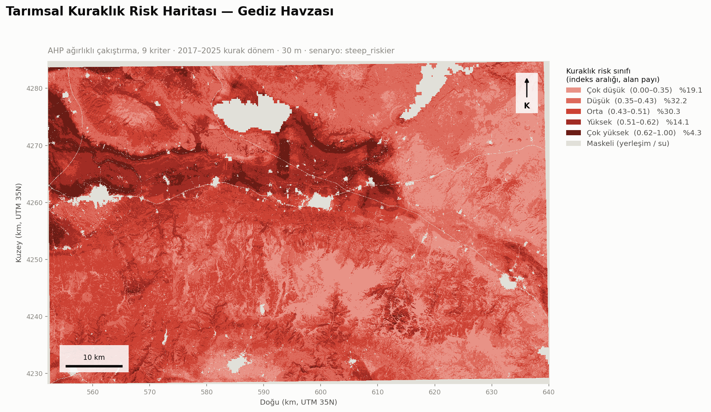
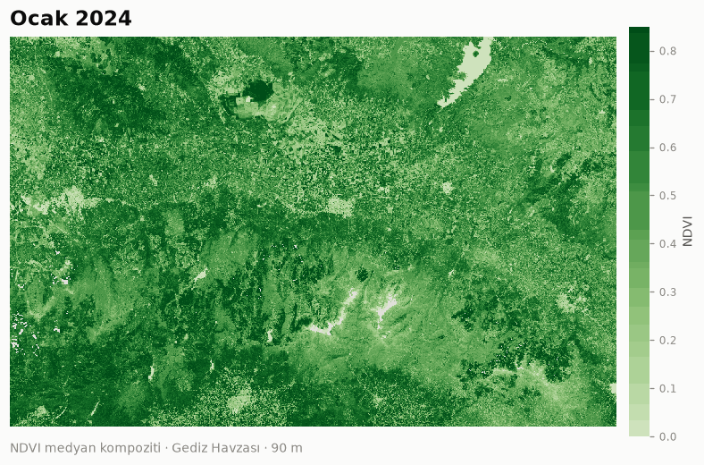
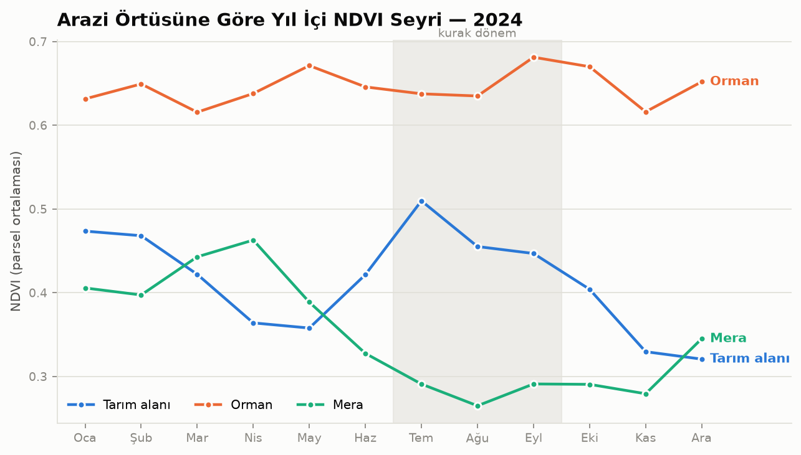
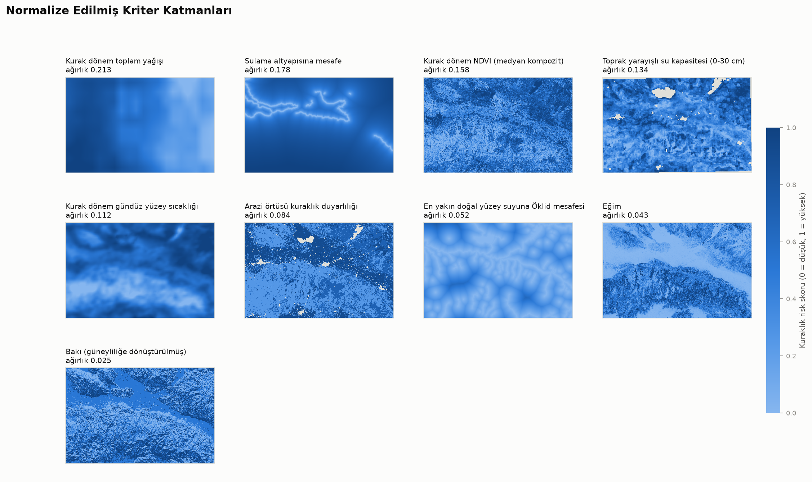
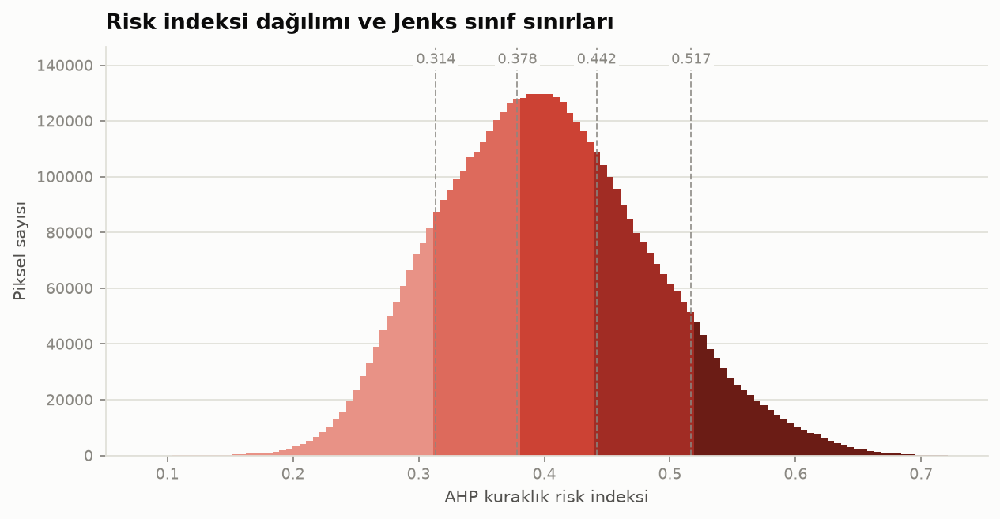
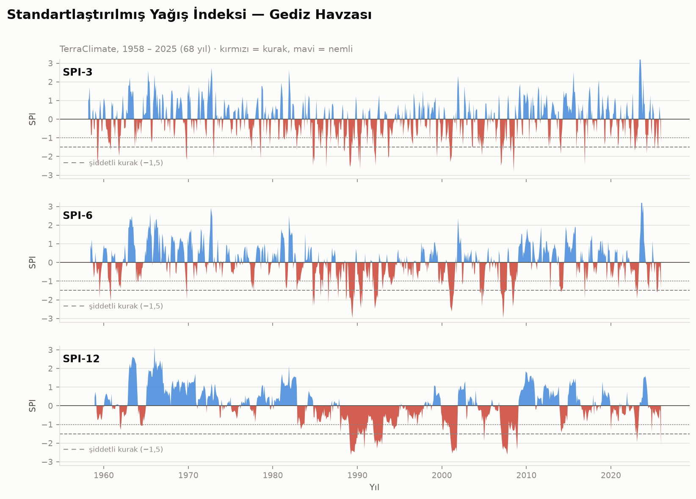
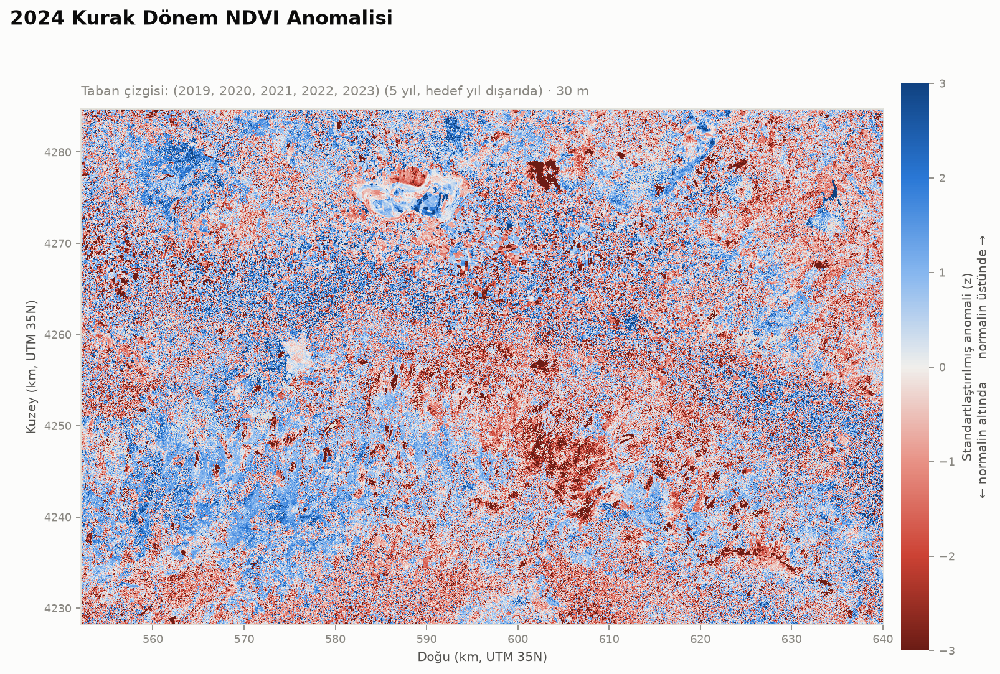

# AHP Tabanlı Tarımsal Kuraklık Risk Haritalama — Gediz Havzası

Çok Kriterli Karar Verme (AHP) ile üretilen 5 sınıflı tarımsal kuraklık risk
haritası, duyarlılık analizi ve NDVI zaman serisi görselleştirmesi.

**Pilot bölge:** Gediz Havzası, Manisa — Salihli / Alaşehir / Sarıgöl hattı
(Demirköprü Barajı membaı dahil), 27.6°E–28.6°E, 38.2°N–38.7°N → **4.842 km²**,
30 m çözünürlükte 5,53 milyon hücre.



---

## Sonuçlar

**AHP ağırlıkları** — 9×9 ikili karşılaştırma matrisinden özvektör yöntemiyle
türetildi, tutarlılık oranı **CR = 0.0093** (eşik 0.10):

| Kriter | Ağırlık | Efektif katkı | Kaynak |
|---|---:|---:|---|
| Kurak dönem yağışı | 0,213 | %20,3 | CHIRPS v2.0 (~5,5 km) |
| Sulama altyapısına mesafe | 0,178 | %16,0 | OpenStreetMap kanal ağı |
| Kurak dönem NDVI | 0,158 | %20,9 | Sentinel-2 L2A (10 m) |
| Toprak yarayışlı su kapasitesi | 0,134 | %12,2 | SoilGrids 2.0 (250 m) |
| Yüzey sıcaklığı (LST) | 0,112 | %11,4 | MODIS MYD11A2 (1 km) |
| Arazi örtüsü duyarlılığı | 0,084 | %8,9 | ESA WorldCover 2021 (10 m) |
| Doğal yüzey suyuna mesafe | 0,052 | %2,6 | OpenStreetMap |
| Eğim | 0,043 | %4,6 | Copernicus DEM GLO-30 |
| Bakı (güneylilik) | 0,025 | %3,1 | Copernicus DEM GLO-30 |

**Efektif katkı**, kriterin ağırlıkla çarpılmış değerlerinin standart sapma
payıdır. AHP ağırlığı kriterin ölçeğinin tamamını kullandığı varsayımıyla
anlam taşır; kullanmıyorsa nominal ağırlığı kadar ayrım üretmez. Burada
`distance_to_water` bu durumda: 728 km'lik akarsu ağı sayesinde alanın %90'ı
suya yakın, skorlar 0–0,74 bandına sıkışıyor.

**Risk sınıfları** (Jenks Natural Breaks):

| Sınıf | Alan | Pay |
|---|---:|---:|
| Çok düşük | 596 km² | %12,9 |
| Düşük | 1.125 km² | %24,3 |
| Orta | 1.361 km² | %29,4 |
| Yüksek | 1.045 km² | %22,5 |
| Çok yüksek | 508 km² | %11,0 |

Bağımsız k-means sınıflandırmasıyla **%97,8 uyum** — sınıflar yöntem seçimine
değil verinin kendi yapısına dayanıyor.

### Duyarlılık analizi

Her ağırlık ±%10 değiştirildiğinde 5 sınıflı haritada aynı sınıfta kalan piksel
oranı **en kötü %92,4** (yağış −%10), en iyi %99,2 (bakı). Spearman sıra
korelasyonu hiçbir senaryoda 0,996'nın altına düşmüyor.

### Sulamanın eklenmesi haritayı nasıl değiştirdi

Sulama kriterinin eklenmesi sonucu kozmetik olarak değil **fiziksel olarak**
değiştirdi:

| | 7 kriter | 9 kriter |
|---|---:|---:|
| Tarım alanının ortalama riski | 0,536 | 0,531 |
| Meranın ortalama riski | 0,536 | 0,576 |
| En riskli yükseklik kuşağı | 33–128 m (ova) | 302–563 m (etek) |

Önceden tarım ve mera **aynı** riskte çıkıyordu ve en riskli yer ova tabanıydı.
Sulama eklenince tarım meranın altına indi ve risk zirvesi ovadan yamaç eteğine
kaydı. Sebep gerçek: Gediz ovası sıcak ve kurak ama **sulanıyor**; yamaç etekleri
hem kurak hem sulama şebekesi dışında. Bu, modelin havzanın işleyişini
yakaladığının işareti.

---

## NDVI zaman serisi





Bu grafik havzanın tarımsal karakterini tek bakışta anlatıyor:

- **Tarım alanı** temmuzda zirve yapıyor (0,51), nisan–mayısta dipte (0,36).
  Bu, yağışa değil **sulamaya** dayalı bir tarım demek — Demirköprü'den beslenen
  pamuk ve bağ, yazın en yeşil olduğu dönemi yaşıyor.
- **Mera** tam tersi: nisanda zirve (0,46), ağustosta dip (0,27) — klasik
  Akdeniz yağış rejimi.
- **Orman** yıl boyu düz (0,62–0,68) — derin kök, mevsimsel strese kapalı.

Sayısal tablo: [`outputs/figures/ndvi_parcel_curves_2024.md`](outputs/figures/ndvi_parcel_curves_2024.md)

---

## Kriter katmanları





---

## Doğrulama

[`validation_report.md`](outputs/reports/validation_report.md) dört seviyeli ve
her seviyenin kanıt değerini açıkça bildiriyor:

**1. Senaryo dayanıklılığı** — eğimin risk yönü literatürde tartışmalı olduğu
için iki senaryo da üretiliyor. Sonuç: piksellerin **%78,0'i aynı sınıfta**,
**%100'ü en fazla 1 sınıf** kayıyor. Tartışmalı karar sonucu değiştiriyor ama
altüst etmiyor.

**2. Buharlaşma oranı ET/PET — BAĞIMSIZ.** MODIS MOD16A3GF yıllık
evapotranspirasyon ürününden. **Modele hiç girmemiş** bir ölçüm: ayrı bir
Penman-Monteith modelinden üretiliyor ve projedeki hiçbir kriter onun girdisi
değil. Beklenti: risk arttıkça ET/PET azalmalı.

| Risk sınıfı | Ortalama ET/PET |
|---|---:|
| Çok düşük | 0,285 |
| Düşük | 0,275 |
| Orta | 0,260 |
| Yüksek | 0,237 |
| Çok yüksek | 0,236 |

Monoton azalıyor; risk indeksiyle Spearman ρ = **−0,331**. Korelasyonun orta
şiddette olması beklenen bir sonuç — 9 kriterli bir risk indeksinin tek bir
buharlaşma oranını birebir öngörmesi zaten beklenmezdi. Asıl anlamlı olan sınıf
sıralamasının monoton çıkması. **Dürüstlük notu:** 4. ve 5. sınıf arasındaki
fark (0,237 → 0,236) neredeyse yok; model en riskli iki sınıfı bu eksende
ayıramıyor. Ayrıca MOD16 MODIS LAI/FPAR kullandığı için bitki örtüsüyle
akrabalığı sıfır değil — "tamamen bağımsız" denemez.

**3. Mevsimsel NDVI genliği (yarı bağımsız)** — ilkbahar tepe ile yaz dip NDVI
farkı: 0,043 → 0,112 → 0,174 → 0,251 → 0,350. Monoton artıyor. Kriter olarak
kullanılan *NDVI seviyesinden* farklı bir büyüklük ama aynı sensörden türediği
için kanıt değeri (2)'ninkinden düşük.

**4. Katmanlı özet** — arazi örtüsüne göre risk: çıplak toprak (0,619) > mera
(0,576) > çalılık (0,564) > **tarım (0,531)** > orman (0,501). Tarımın meranın
altına inmesi sulama kriterinin eseri ve doğru.

### Hâlâ eksik olan

Saha verisiyle doğrulama yapılmadı: TÜİK ilçe bazında verim istatistikleri, DSİ
Demirköprü sulama şebekesinin resmî sınırı, MGM istasyon bazlı SPI/SPEI. Bu
kaynakların açık API'si yok, manuel indirme gerekiyor. Özellikle DSİ şebeke
sınırı önemli: mevcut sulama kriteri OSM'deki kanal ağından türetilen bir
**vekildir**, resmî komuta alanı değil.

---

## Kuraklık izleme ve tahmin (Adım 10)

Risk haritası *yapısal duyarlılığı* gösterir. Adım 10 ona zaman boyutu ekler:

```
RİSK = TEHLİKE (zamanla değişir) × DUYARLILIK (yapısal)
       ↑ Adım 10                   ↑ AHP haritası
```



**SPI** (McKee ve ark. 1993), TerraClimate'ten çekilen **68 yıllık** (1958–2025)
yağış serisinden hesaplanıyor. Doğrulama: ortalama −0,000, standart sapma 1,000
(teorik değerler 0 ve 1). Bağımsız formülasyonlu **PDSI ile r = 0,782**.

Tespit edilen en şiddetli kuraklıklar Türkiye'nin bilinen kurak dönemleriyle
örtüşüyor: **1989-01–1991-02 (26 ay)**, 2000–2001, 1991–1993, **2007 (11 ay)**.

### Tahmin: dürüst sonuç

| Ufuk | Yöntem | Beceri (iklimatolojiye karşı) |
|---|---|---:|
| 1 ay | sönümlü kalıcılık | **+0,395** |
| 1 ay | kalıcılık | +0,259 |
| 3 ay | sönümlü kalıcılık | −0,001 |
| 3 ay | kalıcılık | **−0,964** |
| 6 ay | kalıcılık | **−1,076** |

**3 ay sonrası için bu yaklaşımla tahmin becerisi yok.** Sebep matematiksel:
SPI-3'ün 3 aylık gecikme korelasyonu ρ = −0,024 — sıfır. Ay *t* için SPI-3,
*t−2…t* penceresini toplar; *t+3* için *t+1…t+3*'ü toplar. **İki pencere hiç
kesişmiyor**, dolayısıyla paylaşılan bilgi yok.

Bu, ayarlanarak düzeltilecek bir sonuç değil; verinin söylediği şey. Saf
kalıcılığın 3 ve 6 ayda **eksi** beceri vermesi ise daha da öğretici: "bugünkü
gibi devam edecek" demek, o ufukta hiçbir şey dememekten *kötüdür*.

Gerçek 3 aylık tahmin için dinamik mevsimsel iklim öngörüsü (ECMWF SEAS5,
NOAA CFSv2) gerekir — bunlar ücretsiz ama Copernicus CDS kaydı/API anahtarı
istediği için projenin "anahtarsız" kısıtını kırar.

### İzleme: mekânsal anomali



2024 kurak dönem NDVI'ı, diğer 5 yıla göre z-skoru olarak. Taban çizgisi hedef
yılı **dışlar** (leave-one-out): dahil edilseydi yıl kendi ortalamasını kendine
çeker ve anomali sistematik olarak küçük çıkardı — 5 yıllık bir tabanda bu etki
büyüktür.

Arazi örtüsüne göre ortalama anomali fiziksel olarak tutarlı: mera (−0,378) >
çıplak (−0,273) > tarım (−0,224) > çalılık (−0,093) > orman (−0,071). Sulanan
tarım ve derin köklü orman en az etkilenen, yağışa bağlı mera en çok.

### Risk haritasının operasyonel sınaması — DOĞRULANMADI

| Risk sınıfı | 2024 NDVI anomalisi (z) |
|---|---:|
| Çok düşük | −0,167 |
| Düşük | −0,199 |
| Orta | −0,158 |
| Yüksek | −0,211 |
| Çok yüksek | **−0,292** |

Uçlar doğru yönde (sınıf 5 < sınıf 1) ama sıralama monoton değil ve Spearman
ρ = −0,096, yani zayıf. **Bunu geçirmek için ayar yapmadım.** İki katman farklı
şeyler ölçüyor: risk haritası 6 yıllık ortalamaya dayanan *yapısal* bir indeks
("burası kronik olarak dayanıksız"), anomali ise tek yılın kendi geçmişine göre
sapması ("bu yıl normalinden ne kadar saptı"). Yapısal olarak kurak bir alan
zaten her yıl kuraktır; kendi normaline göre sapması büyük olmak zorunda değil.

Güçlü sınama, birden çok kurak yılın anomali ortalamasıyla ya da doğrudan verim
verisiyle yapılır.

## NDVI mi EVI mi?

Jia ve ark. (2020) EVI'nin kuraklık duyarlılığını göstermede NDVI'dan biraz
daha başarılı olduğunu buluyor. Bu havza için sınandı:

| | NDVI | EVI |
|---|---:|---:|
| Bağımsız ET/PET ile ρ (ham katman) | **+0,647** | +0,618 |
| Bağımsız ET/PET ile ρ (risk haritası) | **−0,331** | −0,283 |

İki indeks ρ = 0,956 korelasyonlu; risk haritaları %87,2 aynı sınıfta, %100'ü
en fazla 1 sınıf kayıyor. **Bu havzada indeks seçimi belirleyici değil ve
NDVI biraz daha uyumlu** — literatürdeki genel bulgu burada geçerli çıkmadı.
`vegetation_index: ndvi | evi` ile değiştirilebilir.

## Yöntem notları

- **Bakı dairesel bir değişkendir.** 0–360° doğrudan normalize edilemez (359° ile
  1° komşudur ama ölçeğin iki ucuna düşer). `southness = (1 − cos θ) / 2` ile
  skalarlaştırılıyor: kuzey → 0, güney → 1. Eğimin 1°'nin altında olduğu düz
  alanlarda bakı tanımsız kabul edilip nötr değer (0,5) atanıyor.
- **Eğimin risk yönü tartışmalı.** "Dik yamaç → hızlı yüzey akışı → düşük
  infiltrasyon" ile "düz ova → zayıf drenaj → yüksek buharlaşma" görüşleri
  çatışıyor. Proje tercihi gizlemek yerine iki senaryoyu da üretiyor
  (`scenarios.steep_riskier` / `flat_riskier`) ve farkı raporluyor.
- **Maske yayılımı.** Kriterlerden biri bir pikselde tanımsızsa (yerleşim, su
  yüzeyi) o piksel sonuçta da tanımsız kalıyor. Eksik kriteri sıfır saymak
  pikseli yapay olarak "düşük riskli" gösterirdi. Alanın %2,9'u maskeli.
- **Ölçek uyumsuzluğu.** CHIRPS (~5,5 km) ve MODIS LST (1 km) katmanları 30 m
  grid'e yeniden örnekleniyor. Bu katmanlar *bölgesel* gradyan taşır, yerel
  detay değil; sonuçlar 30 m hassasiyetinde yorumlanmamalı.
- **Kısmi döngüsellik.** NDVI hem girdi kriteri hem de görselleştirme ekseni.
  Doğrulama bu yüzden NDVI *seviyesi* yerine *mevsimsel genliği* kullanıyor,
  ama tam bağımsızlık ancak saha verisiyle sağlanır.
- **Renk paleti gerekçelendirildi.** Risk sınıfları ordinal olduğundan tek hue
  üzerinde monoton açıklık adımları kullanılıyor. Yaygın mavi–sarı–kırmızı
  gökkuşağı paleti erişilebilirlik kontrollerinin 4'ünden 3'ünde kalıyordu
  (açıklık monoton değil, tek hue değil, sarı orta sınıf beyaz zeminde
  1,01:1 kontrastla kayboluyor).

---

## Yol boyunca bulunan ve düzeltilen veri hataları

Bu bölüm projenin en öğretici kısmı — hiçbiri hata vermeden, sessizce yanlış
sonuç üretecekti:

**1. Sentinel-2 baseline 04.00 radyometrik offset'i.** 25 Ocak 2022'den itibaren
tüm L2A bantlarına `BOA_ADD_OFFSET = −1000` uygulanıyor ve Planetary Computer
veriyi düzeltmeden sunuyor. Bu AOI'de ölçülen etki (Ağustos, bulut <%10):

| Yıl | baseline | B04 | B08 | NDVI (ham) | NDVI (düzeltilmiş) |
|---|---|---:|---:|---:|---:|
| 2019 | 02.12 | 1180 | 2859 | 0,416 | — |
| 2021 | 03.00 | 1232 | 2869 | 0,399 | — |
| 2022 | 04.00 | 2103 | 3712 | 0,277 | **0,422** |
| 2024 | 05.11 | 2245 | 3873 | 0,266 | **0,395** |

Düzeltilmeden 2022 sonrası yıllar sistematik olarak ~0,13 düşük NDVI veriyordu.
Kuraklık haritasında bu, "son yıllarda bitki örtüsü stresi arttı" diye
okunacaktı — üstelik NDVI 0,221 ağırlıkla ikinci en önemli kriter. Düzeltme
item bazında, `s2:processing_baseline` özelliğine göre uygulanıyor.

**2. Yanlış UTM zone.** Başlangıçta EPSG:32636 (UTM 36N) yazılmıştı; bu zone
30°E'den başlıyor, AOI ise 27,6–28,6°E. Bölge tamamen zone dışında kalıyor ve
ciddi ölçek deformasyonu üretiyordu. Doğrusu **EPSG:32635**.

**3. MODIS koleksiyonu iki platformu karıştırıyor.** `modis-11A2-061` hem Terra
(MOD11A2, ~10:30 geçiş) hem Aqua (MYD11A2, ~13:30) ürünlerini içeriyor ve
item'ların `platform` özelliği boş geliyor — ayrım yalnızca id ön ekinden
yapılabiliyor. Karıştırmak geçiş saati farkı yüzünden birkaç K sistematik sapma
demek. Aqua'ya sabitlendi.

**4. Senaryo kriterleri aynı dosyayı paylaşıyordu.** `slope.tif` her iki
senaryoda da aynı yola yazılıyordu; `flat_riskier` sessizce `steep_riskier`ın
katmanını okuyor, iki senaryo aynı çıkıyor ve senaryo karşılaştırması anlamsız
bir %100 uyum raporluyordu. Senaryoya bağlı kriterler artık dosya adında senaryo
etiketi taşıyor.

**5. Jenks sınıflandırması tekrarlanabilir değildi.** `mapclassify.NaturalBreaks`
küme başlangıçlarını global numpy RNG'sinden çekiyor; tohumlanmadığı için aynı
veriyle iki çalıştırma farklı sınıf sınırları veriyordu (~0,009 indeks birimi —
sınıf sınırlarını kaydırmaya yeter).

**6. Sulama kriteri sabit tavanla tavana yapışıyordu.** İlk denemede 5 km'lik
sabit mesafe tavanı kullanıldı. Ölçülen dağılım (p10 = 1,2 km, p50 = 9,2 km,
p90 = 25,2 km) alanın **%68,9'unun tavana yapıştığını** gösterdi — 0,178
ağırlıklı bir kriterin çoğu piksel için ayrım üretmemesi demekti. Log uzayında
yüzdelik normalizasyona geçildi (tavana yapışan alan %2,2), efektif katkı
%16,0'a çıktı. Bu değişikliğin gerekçesi statistiksel değil fiziksel: erişim
etkisi oransaldır ve OSM'de yalnızca ana kanallar haritalı olduğu için mutlak
mesafeler güvenilmez, sıralama güvenilirdir.

**7. Etiket grupları ağ hatasına dayanıklı değildi.** Grupları ayrı sorgulamanın
amacı dayanıklılıktı, ama yalnızca "sonuç yok" hatası yakalanıyordu; Overpass
zaman aşımı ilk grup başarılı olsa bile tüm katmanı düşürüyordu. Şimdi ağ hatası
ile boş sonuç ayrı ele alınıyor, birden çok Overpass aynası deneniyor ve
**kısmi bir ağdan mesafe raster'ı üretilmesine izin verilmiyor** — eksik ağdan
hesaplanan mesafe sessizce yanlış olurdu.

**8. PROJ çakışması.** Geliştirme makinesindeki PostgreSQL/PostGIS kurulumu
`PROJ_LIB` ve `GDAL_DATA` değişkenlerini sistem genelinde kendi eski PROJ
veritabanına ayarlamış; rasterio hiçbir EPSG kodunu çözemiyordu.
[`src/_geoenv.py`](src/_geoenv.py) içe aktarma anında sanal ortamın gömülü PROJ
kopyasına yönlendiriyor.

---

## Kurulum

```bash
python -m venv .venv
.venv\Scripts\activate          # Windows
# source .venv/bin/activate     # Linux / macOS
pip install -r requirements.txt
```

Python 3.13 ile test edilmiştir. **Hiçbir veri kaynağı API anahtarı
gerektirmez.**

> **PROJ çakışması.** Makinede PostgreSQL/PostGIS, QGIS veya OSGeo4W kuruluysa
> bunlar `PROJ_LIB` / `GDAL_DATA` değişkenlerini sistem genelinde kendi
> `proj.db` dosyalarına ayarlar ve rasterio hiçbir EPSG kodunu çözemez
> (`DATABASE.LAYOUT.VERSION.MINOR = 2 whereas a number >= 6 is expected`).
> `src/_geoenv.py` bunu içe aktarma anında otomatik düzeltir; sistem
> değişkenlerine dokunmaz. Devre dışı bırakmak için `AHP_KEEP_SYSTEM_PROJ=1`.

## Çalıştırma

```bash
# Adım 1 — AOI, ortak grid, AHP tutarlılık kontrolü
python -m scripts.step01_define_grid

# Adım 2 — Veri indirme (~1,5 saat, önbellekli ve kesintiye dayanıklı)
python -m scripts.step02_fetch_data --list      # katmanlar ve süreleri
python -m scripts.step02_fetch_data
python -m scripts.step02_fetch_data --only dem,water --overwrite

# Adım 3 — Kriter raster'ları
python -m scripts.step03_build_criteria
python -m scripts.step03_build_criteria --scenario flat_riskier --only slope

# Adım 4-5 — AHP çakıştırma, duyarlılık, risk haritası
python -m scripts.step04_risk_map

# Adım 6 — NDVI animasyonu ve parsel eğrileri
python -m scripts.step06_ndvi_timeseries

# Adım 7 — Doğrulama raporu
python -m scripts.step07_validate

# Adım 10 — Kuraklık izleme ve tahmin
python -m scripts.step10_forecast --fetch    # 68 yıllık seriyi indir (~25 dk)
python -m scripts.step10_forecast

# NDVI/EVI karşılaştırması
python -m scripts.compare_vegetation_index

# Grup AHP anketi
python -m scripts.ahp_survey template --out surveys --experts 5
python -m scripts.ahp_survey aggregate surveys/*.csv

# Testler
pytest                    # hepsi
pytest -m "not network"   # dış servise bağlanmadan
```

Her katman `data/interim/` altına yazılır ve dosya varsa atlanır; uzun süren
Sentinel-2 işi kesilse bile aynı komut kaldığı yerden devam eder.

## Proje yapısı

```
config.yaml                  Tüm ağırlıklar, eşikler, veri kaynakları, renkler
lookups/                     Kategorik → skor dönüşüm tabloları
src/
  config.py                  Yükleme, doğrulama, senaryolar, kriter yolları
  grid.py                    Ortak grid, reproject_to_grid(), hizalı G/Ç
  aoi.py                     Çalışma alanı
  ahp.py                     Özvektör, tutarlılık oranı, duyarlılık ağırlıkları
  fetch/                     Adım 2 — kaynak başına bir modül
  criteria/                  Adım 3 — eğim/bakı, mesafe, lookup, normalizasyon
  overlay.py                 Adım 4 — ağırlıklı çakıştırma, efektif katkı
  classify.py                Adım 5 — Jenks, k-means çapraz kontrolü
  visualize.py               Adım 5 — harita, panel, histogram
  animate.py                 Adım 6 — GIF ve parsel eğrileri
  validate.py                Adım 7 — üç seviyeli doğrulama
scripts/                     Adım adım çalıştırılabilir betikler
tests/                       153 pytest testi
outputs/{figures,reports}    Harita, animasyon, raporlar
docs/references.md           Literatür künyeleri
```

**Hiçbir ağırlık, eşik, sınıf skoru veya renk kod içine gömülü değildir** —
hepsi `config.yaml` veya `lookups/` içinden gelir. `config.yaml`'ı bozan her
değişiklik (matris boyutu, eksik kriter, ters bbox, sınıf/renk sayısı
uyuşmazlığı) kod çalışmadan anlaşılır bir hata verir.

## Veri kaynakları

| Veri | Sağlayıcı | Erişim |
|---|---|---|
| Copernicus DEM GLO-30 | Microsoft Planetary Computer (STAC) | Açık, anahtarsız |
| Sentinel-2 L2A | Microsoft Planetary Computer (STAC) | Açık, anahtarsız |
| ESA WorldCover 2021 | Microsoft Planetary Computer (STAC) | Açık, anahtarsız |
| MODIS MYD11A2 (LST) | Microsoft Planetary Computer (STAC) | Açık, anahtarsız |
| CHIRPS v2.0 | Climate Hazards Center, UCSB | Açık HTTP |
| Akarsu / göl vektörü | OpenStreetMap (osmnx) | Açık, ODbL |

Tam künyeler ve ağırlıkların literatür dayanağı:
[`docs/references.md`](docs/references.md)

## Ağırlıkların literatürle karşılaştırması

| Kriter | Bu proje | Pandey & Srivastava (2019) | Sarkar ve ark. (2024)* |
|---|---:|---:|---:|
| Yağış | 0,213 | 0,445 | — |
| **Sulama erişimi** | **0,178** | — | **0,187** |
| NDVI | 0,158 | 0,050 | 0,127 |
| **Toprak su kapasitesi** | **0,134** | 0,252 (toprak nemi) | — |
| LST | 0,112 | 0,158 | — |
| Arazi örtüsü | 0,084 | — | 0,164 |
| Ekim yoğunluğu | — | — | 0,237 |

\* tarımsal kuraklık bileşeni, bildirilen CR = %5,8

Sulama erişimi ağırlığı (0,178), Sarkar ve ark.'nın bildirdiği 0,187 ile
neredeyse aynı — matris literatüre bakılarak kurulduğu için bu bir doğrulama
değil, tutarlılık işareti.

## Grup AHP anket aracı

Mevcut matris **yazar tarafından**, literatürdeki sıralamaya dayanarak kurulmuş
bir başlangıç setidir. Akademik kullanımda uzman anketiyle kurulması beklenir.
Bunun altyapısı hazır:

```bash
python -m scripts.ahp_survey template --out surveys --experts 5
# uzmanlar formları doldurur (9 kriter -> 36 ikili karşılaştırma)
python -m scripts.ahp_survey aggregate surveys/*.csv
```

Araç, uzman başına CR hesaplar, eşiği aşanları **rapora yazarak** dışlar,
kalanları **geometrik ortalamayla** birleştirir (Aczél & Saaty 1983 — aritmetik
ortalama karşılıklılığı bozar: 3 ve 1/3 diyen iki uzmanın ortalaması 1 olmalı,
1,67 değil) ve `config.yaml`'a yapıştırılabilir bir matris üretir.

**Anketin kendisi insan işidir** — araç uzman görüşünün yerine geçmez.

## Sınırlılıklar — kısa liste

1. **Sulama katmanı bir vekildir.** OSM'deki kanal ağından (237 km) türetiliyor;
   DSİ'nin resmî komuta alanı değil. OSM'de yalnızca ana kanallar haritalı,
   tersiyer şebeke eksik. Resmî veri edinildiğinde bu kriter doğrudan onunla
   değiştirilmeli.
2. **İkili karşılaştırma matrisi uzman anketiyle kurulmadı.** Araç hazır, anket
   yapılmadı.
3. **Saha verisiyle doğrulama yok.** TÜİK/DSİ/MGM'nin açık API'si yok.
4. **Ölçek uyumsuzluğu:** yağış ~5,5 km, LST 1 km, toprak 250 m katmanları
   30 m grid'e yeniden örnekleniyor.
5. **NDVI kısmen döngüsel:** hem girdi kriteri hem doğrulama ekseni.
   EVI'ye geçiş ölçülebilir bir iyileşme sağlayabilir (Jia ve ark. 2020).
6. **Toprak verisinde %5,6 boşluk** var (SoilGrids, su yüzeyi ve kayalık).
   Maske yayılımı nedeniyle bu pikseller sonuçta da tanımsız kalıyor —
   maskeli alan toplam %6,8.
